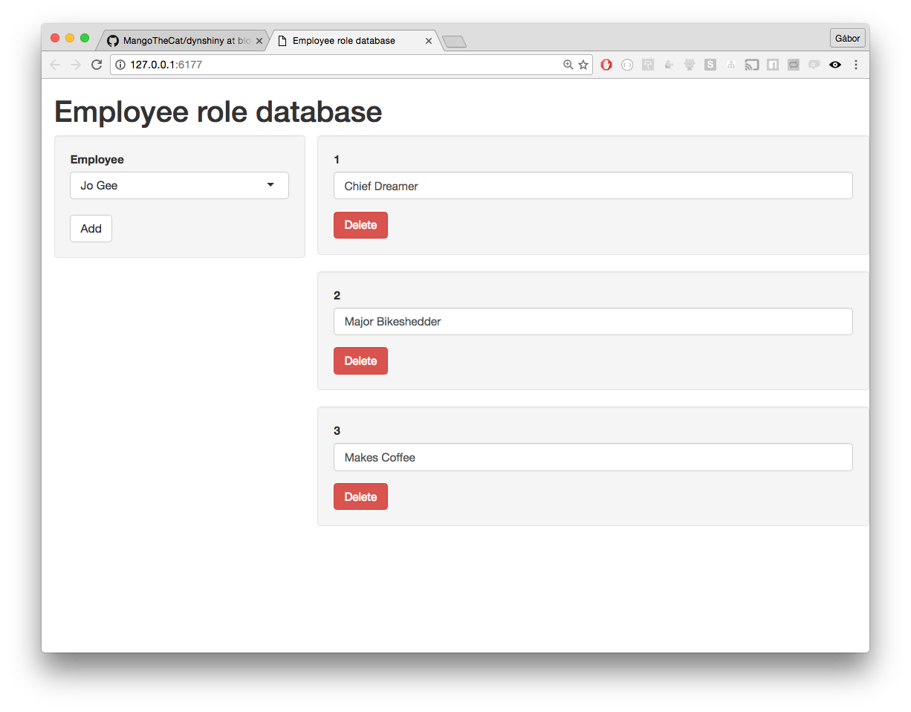
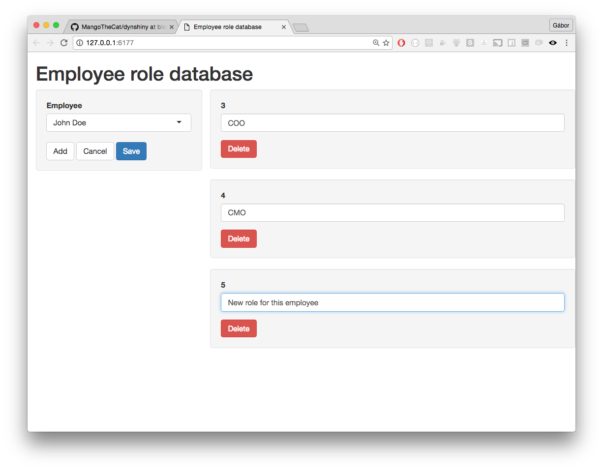

## Introduction

It is not uncommon that the user interface of a Shiny application needs to be
generated dynamically, based on data or program state. One typical use case
that we encounter frequently is when the UI lets the user edit a variable number
of records from a database.

Imagine that you have an employee database, where each employee can be
assigned multiple roles. Each role also has additional data, for
example, the proportion of work time the employee is expected to perform
that role or a comment field. In a relational database, you would
store this information in a `roles` table, where each row corresponds to
one of the role assignments of an employee. When writing a Shiny app to edit
the database, it makes sense to edit all roles of an employee on the same
page: add or delete roles, or modify existing ones. This requires
generating the user interface (UI) of the app dynamically, based on the
database.

<br>


<br>

## Requirements

We want our app to satisfy the following requirements:
* It must handle multiple employees, i.e. when a new employee is selected
  from the employee list, it should read in and show all current roles of that
  employee.
* It must be able to edit existing roles of an employee, and then update
  the database.
* It must be able to add new roles to an employee, and write the updated
  data to the database.
* It must be able to delete roles from an employee, and write the updated
  data to the database.
* It must be able to handle an arbitrary number of roles for an employee,
  including no roles at all.
* It must only modify the database once the user clicks on the `Save`
  button.
* It must have a `Cancel` button that discards all edits, and shows the
  employee roles as last read from the database.
* The `Save` and `Cancel` buttons must be hidden if the employee data have
  not been changed.

While these requirements are quite straightforward, they are not trivial
to implement in Shiny. In the rest of this post we build an app that
implements them.

## The app

```{r}
library(shiny)
```

### The UI part of the app

The UI definition of the app is quite straightforward, as most of the
content will be dynamically generated. We will have the employee selection
box on a side panel, and the roles of the selected employee on the main
panel.

```{r}
ui <- shinyUI(pageWithSidebar(
  headerPanel("Employee role database"),
  sidebarPanel(
    selectInput(
      "employee",
      "Employee",
      choices = c("Jo Gee", "John Doe")
    ),
    uiOutput("buttons")
  ),
  mainPanel(
    uiOutput("roles")
  )
))
```

For this simple example, we just list all employees here. In practice the
employee names come from the database, of course.

`buttons` will contain the `Add`, `Save` and `Cancel` buttons. The last
two are dynamic, as they are only shown if the roles have changed. For 
simplicity we generate all three buttons dynamically.

### Structure of the app

This app is different to others, as a significant part of it is
event-driven. Many (most?) Shiny apps are purely reactive, i.e. they only
contain recipes for how the different output values can be updated, and 
then it is up to Shiny to make sure that they are updated whenever they
need to.

We found it hard to write this app the traditional way, mainly because the
UI contains multiple action buttons that trigger dynamic UI changes, and also
because the internal representation of the data must be changed without any
output changes.

The app will have the following main components:
* We need to store the data that is on the user's screen, and update it,
  as it changes. This will be in the `data` reactive value.
* We need to store the data in a database, to be able to compare
  it to the data under editing and show/hide the 'Save' and 'Cancel' buttons. 
  We'll use the `dbdata()` reactive for this.
* We will use a `renderUI()` call to create the 'Add', 'Cancel' and 'Save'
  buttons, as needed.
* We'll attach events to the 'Add', 'Cancel' and 'Save' buttons, using
  `observeEvent()`.
* We'll use a `renderUI()` call to create the UI for the records, with a 
  helper function, `createRecord()`, that creates a single record.

### Triggering UI changes

To trigger UI changes as needed, we introduce a reactive trigger construct:
```{r}
makeReactiveTrigger <- function() {
   rv <- reactiveValues(a = 0)
   list(
     depend = function() {
       rv$a
       invisible()
     },
     trigger = function() {
       rv$a <- isolate(rv$a + 1)
     }
   )
 }
```
`makeReactiveTrigger` creates reactive triggers. A reactive trigger has
two parts: 
1. `$depend()` can be used within reactive expressions to declare that
   the reactive expression must be updated whenever the trigger sets off.
2. `$trigger()` sets off the trigger.   
For the purpose of this post it is not very important to know how a reactive
trigger works. It is sufficient to know that whenever it is `trigger()`-ed,
all the `depend()`ent reactives are updated.

### The `server` function

We are ready to write the more complicated `server` function.

We will use the `data` reactive value to store the current values of the
roles. `data` is updated whenever the input widgets change (see later, 
when we create these widgets in `createRecord()`). 

We assume that `data` is a data frame and each role corresponds to a row
in it. For this simple app `data` has columns `id` and `role` only. Other
metadata can be easily added as additional columns. The `id` field is a
simple numeric id of the employee. For now we set `data` to `NULL`. It 
will be automatically updated to the first (=default) employee's data 
when the app loads.

```{r server-1, eval = FALSE, purl = TRUE}
server <- function(input, output, session) {
  rvs <- reactiveValues(data = NULL)
```

We'll use `uiTrigger` to trigger a UI rebuild for the records, this trigger is the heart of the app.
`fileTrigger` is used to trigger an update of `dbdata()`, i.e. to (re)read the data from the database.

```{r server-2, eval = FALSE, purl = TRUE}
  uiTrigger <- makeReactiveTrigger()
  fileTrigger <- makeReactiveTrigger()
```

`dbdata()` provides the last version of the employee records as they are in the database.
It is updated whenever a new employee is selected (`input$employee`) and an update
can also be triggered via `fileTrigger`.

For simplicity, we assume that each employee's data is stored in a CSV file
that is named according to the employee. It is easy to change this to a
proper database query.

```{r server-3, eval = FALSE, purl = TRUE}
  dbdata <- reactive({
    cat("i reading input file\n")
    fileTrigger$depend()
    req(input$employee)
    filename <- paste0(input$employee, ".csv")
    read.csv(filename, stringsAsFactors = FALSE)
  })
```

If new data is read from the database, then we also need to trigger a UI rebuild.
For this we simply put an event handler on the `dbdata()` reactive. This runs 
every time the reactive is updated.

```{r server-4, eval = FALSE, purl = TRUE}
  observeEvent(dbdata(), {
    rvs$data <- dbdata()
    uiTrigger$trigger()
  })
```

### Dynamic `Cancel` and `Save` buttons

The `Add` button is always shown. The `Cancel` and `Save` buttons are only
shown if `data` and `dbdata` are not the same.

```{r server-5, eval = FALSE, purl = TRUE}
  dataSame <- reactive({
    identical(rvs$data, dbdata())
  })

  output$buttons <- renderUI({
    div(
      actionButton(inputId = "add", label = "Add"),
      if (! dataSame()) {
        span(
          actionButton(inputId = "cancel", label = "Cancel"),
          actionButton(inputId = "save", label = "Save",
                       class = "btn-primary")
        )
      } else {
        span()
      }
    )
  })
```

### Add reactivity

So again, parts of this app are event-driven. We specify what should
happen whenever the user presses the various action buttons or edits
the roles.

The first event we need to handle is adding a new role. We create a new id 
for it first and then just add it to the bottom of the data frame that holds
the data. Then we trigger a UI rebuild.

```{r server-6, eval = FALSE, purl = TRUE}
  observeEvent(input$add, {
    cat("i adding a new record\n")
    newid <- if (nrow(rvs$data) == 0) {
      1L
    } else {
      max(as.integer(rvs$data$id)) + 1L
    }
    rvs$data <- rbind(rvs$data, list(id = newid, role = ""))
    uiTrigger$trigger()
  })
```

When the `Cancel` button is hit, we need to restore the data from
`dbdata()`. Then we trigger a UI rebuild. This is not always needed
but it is the simplest way to make sure that the UI shows the current
data.

```{r server-7, eval = FALSE, purl = TRUE}
  observeEvent(input$cancel, {
    cat("i cancelling edits\n")
    rvs$data <- dbdata()
    uiTrigger$trigger()
  })
```

The `Save` button is also simple. We write out the file and make sure that 
the `dbdata()` reactive is updated using `fileTrigger`. 
This will also trigger an unnecessary UI rebuild in the end but we
can live with that.

```{r server-8, eval = FALSE, purl = TRUE}
  observeEvent(input$save, {
    cat("i saving to file\n")
    filename <- paste0(input$employee, ".csv")
    write.csv(rvs$data, filename, quote = FALSE, row.names = FALSE)
    fileTrigger$trigger()
  })
```

### The main dynamic UI

The next part is the main UI that contains the employee roles.
We use `uiTrigger$depend()` to denote that this `renderUI` expression
needs to run whenever a UI rebuild is triggered.

Note the use of `isolate`. We do not want `output$roles` to depend on
`rvs$data` directly, because we only want to rebuild the UI after selected
events, but not all data changes. E.g. if the user just edits a text input,
no UI rebuild is needed.

We use `create_role` to create the UI and (possibly) the event wiring for
each role. Its first argument is the widget id, a number between `1` and
`n`, where `n` is the number of roles on the screen.

```{r server-9, eval = FALSE, purl = TRUE}
  output$roles <- renderUI({
    cat("i rebuild the UI\n")
    uiTrigger$depend()
    mydata <- isolate(rvs$data)
    w <- lapply(seq_len(nrow(mydata)), function(i) {
      create_role(i, mydata[i, ])
    })
    do.call(fluidRow, w)
  })
```

### Creating the UI for a role

This is another key part of the app and it is also the part that is easy to
write incorrectly. `create_role` is a closure, a function that creates both
a function and an environment to store data.

We need the environment to store the maximum number of widgets that were
wired up with edit and delete events. We need this because in Shiny it is
not (easily) possible to remove bindings (i.e. `observeEvent` triggers). So
even if we rebuild the UI and remove some elements, the previously created
triggers will still be in effect, and recreating them will trigger duplicate
events.

```{r server-10, eval = FALSE, purl = TRUE}
  create_role <- (function() {

    inited <- 0

    function(wid, record) {
      w <- div(wellPanel(
        textInput(
          paste0("inp-", wid),
          label = record$id,
          value = record$role
        ),
        actionButton(
          paste0("del-", wid),
          label = "Delete",
          class = "btn-danger"
        )
      ))
```

So every time we build a widget with a given id (`wid`) number we only create new `observeEvent`
triggers if the widget's events weren't already wired up.

In other words, the newly built UI will reuse as many of the existing wired
widgets as possible. `inited` stores the number of `wired` widgets and the
id's of their inputs and delete buttons are `inp-x` and `del-x`, where `x`
is a number between 1 and `inited`.

Note that editing the text input field does not trigger a UI rebuild and
this is intentional. We don't want rebuilds just because the user has typed
in something new in the input field.

```{r server-11, eval = FALSE, purl = TRUE}
      if (wid > inited) {
        observeEvent(input[[paste0("inp-", wid)]], {
          rvs$data[wid, "role"] <- input[[paste0("inp-", wid)]]
        })

        observeEvent(input[[paste0("del-", wid)]], {
          rvs$data <- rvs$data[-wid, , drop = FALSE]
          uiTrigger$trigger()
        })
```

We need to update `inited` if we created wiring for a new widget.

```{r server-12, eval = FALSE, purl = TRUE}
	    inited <<- wid
      }

      w
    }
  })()
}
```

Note that here we create a function and call it immediately. 
The function itself creates and returns a function, which we
assign to `create_role`. The effect of this is that every time
we run `create_role`, it has access to the same `inited` variable
and updates it as needed. `inited` is in the parent environment of
`create_role`.

Another non-obvious observation is that (by default) `observeEvent`
evaluates the expression in the environment of its caller, which is the
execution environment of the running`create_role` function.
Execution environments are usually temporary but in this case
the `observeEvent` expression keeps a reference to it, so it is kept
alive. This environment stores the value of `wid` at the time
the event handler was created. This way, every event handler expression
refers to its own `wid` value.

We are now ready to start the app.

```{r server-13, eval = FALSE, purl = TRUE}
shinyApp(ui, server, options = list(height = 1600))
```

## Summary

It took me (Gábor) a couple of attempts to write the first version of this
small Shiny app. My initial, purely reactive (i.e. without reactive 
values and triggers) attempts all failed. Then Joe helped me simplify 
it, introduced the reactive trigger expression and gave me important
insight about imperative and reactive apps.

While we expressed much of the app imperatively, it is important to understand
that there isn't an either/or relationship between imperative and reactive.
What we want to do is identify which pieces of state need to be treated
imperatively, and which can still be handled reactively.

The question you have to answer is: "Can this state be derived/computed 
from another state already represented in the system?" If so, it's a strong 
candidate for being made into a reactive expression instead.

## Exercises

1. Since we wrote the first version of the app, Shiny introduced
`insertUI` and `removeUI`. These are probably better alternatives
to our `create_role` closure. You need to know a tiny bit about
CSS selectors to use them. Modify the app to use `insertUI` and 
`removeUI`.

2. (Hard.) Write a reusable Shiny module that encapsulates the complexity
of this problem. Maybe the module could have the following parameters:
    * function to read in the data,
    * function to save the data,
    * function to build the UI of a single record, from the data, and an
      object id.

## Feedback

We would be very excited to hear about improvements or alternative
solutions to this problem. Should you have one, please open an issue
in the https://github.com/MangoTheCat/dynshiny repository. Thank you!

### Try the app

To try the app, go to https://mangothecat.shinyapps.io/dynshiny/.

```{r ref.label = paste0("server-", 1:13), purl = FALSE, echo = FALSE}
```
